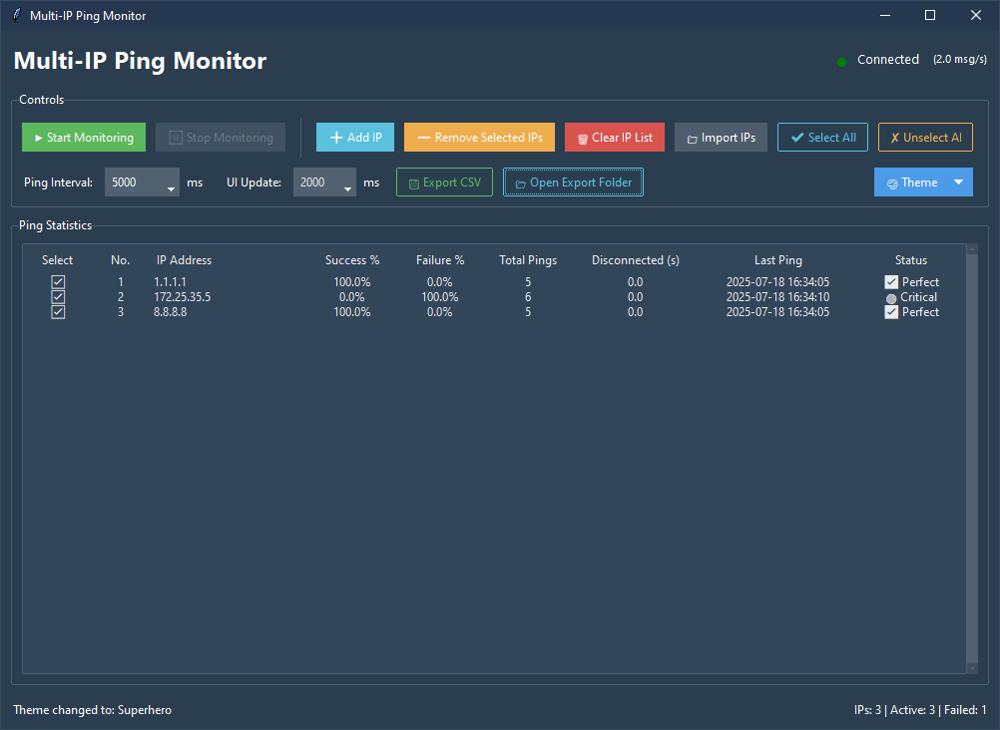

# Ping Check

A simple multithreaded Rust program to check network reachability of multiple IP addresses using `ping`.

<p align="center">
  
</p>

---

## 🔧 Features

- ✅ Read IP addresses from a file (`ips.txt`)
- ⚡ Spawn a thread for each IP to ping concurrently every 5 seconds
- 📊 Display real-time reachability status in both terminal and GUI
- 💻 Simple Python GUI using `ttkbootstrap` with:
  - Start/Stop control
  - Theme switcher (dark/light)
  - Live table of IPs and ping status
  - Export result to CSV
- 🌐 Cross-platform core (Rust): compatible with Windows, Linux, and macOS  
- 🪟 GUI supported on Windows (via Python + `tkinter`)

## 📦 Setup & Usage
> ### ***Simple: download a release available for windows | Click | and Run.***

> ### **-> Or build from source**

### 1. Build the Rust backend

```bash
cd Ping_check
cargo build --release
````

This will generate the executable `ping_check.exe` (on Windows) or `ping_check` (on Linux/macOS) in the `target/release/` folder.

### 2. Prepare your IP list

Create a file named `ips.txt` in the same directory:

```txt
8.8.8.8
1.1.1.1
192.168.1.1
```

### 3. Launch the GUI (Python)

Install dependencies:

```bash
pip install ttkbootstrap
```

Run the GUI:

```bash
python gui.py
```

> ✅ Make sure `ping_check.exe` is in the same directory as `gui.py`.

### 4. Exporting Results

* Click the **Export** button in the GUI to save the current IP reachability to `result.csv`.

---

## 📁 Project Structure

```
Ping_check/
├── src/
│   └── main.rs         # Rust backend
├── gui.py              # Python GUI
├── ips.txt             # List of IPs to ping
├── result.csv          # Output file (generated)
├── ping_check.exe      # Built executable (on Windows)
```

---

## 🔄 Communication

* GUI sends commands to the Rust backend via subprocess
* Backend prints status for each IP in stdout
* GUI reads this output in real time to update the table

---

## ✍️ Author

[Do Huy Hoang](https://github.com/dohuyhoang93)
